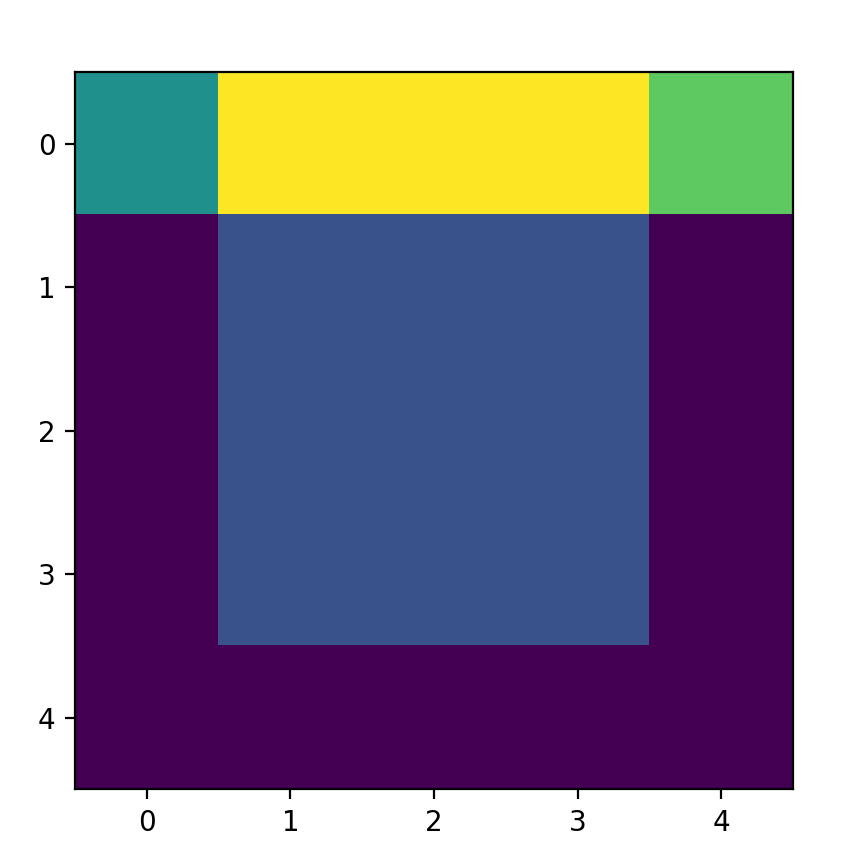
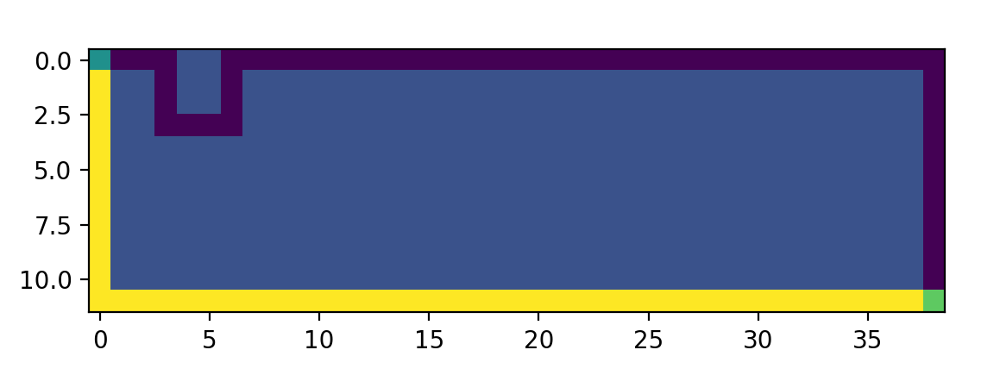
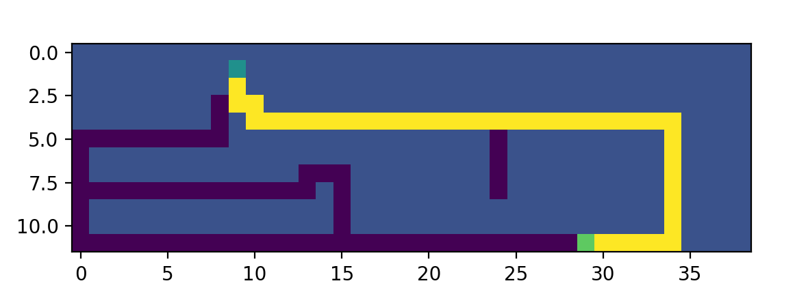
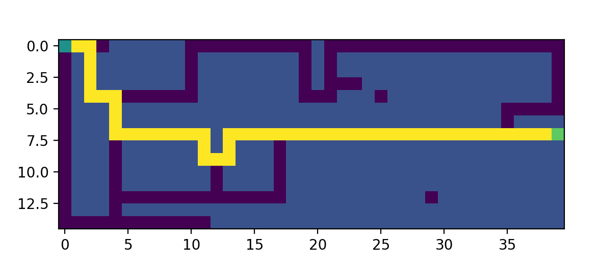

# Finding a way in maze with BFS (breadth-first search) algorithm
Repository contain implementation of breadth-first search algorithm which was used as a method of finding path from start to finish point in maze. This was a recruitment task for science club [CybAiR](http://cybair.put.poznan.pl/).

### Breadth-First Search algorithm
MIT lecture about [BFS](https://www.youtube.com/watch?v=s-CYnVz-uh4&list=PLUl4u3cNGP61Oq3tWYp6V_F-5jb5L2iHb&index=13).

### Results of algorithm
#### map 1

#### map 2

#### map 3

#### map 4

